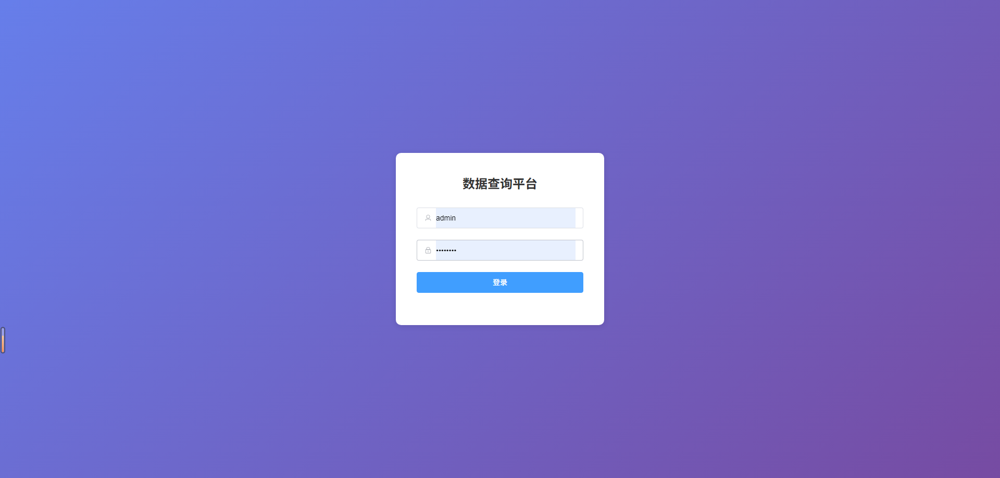
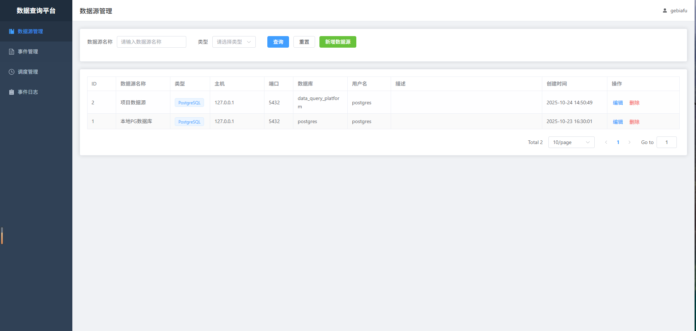
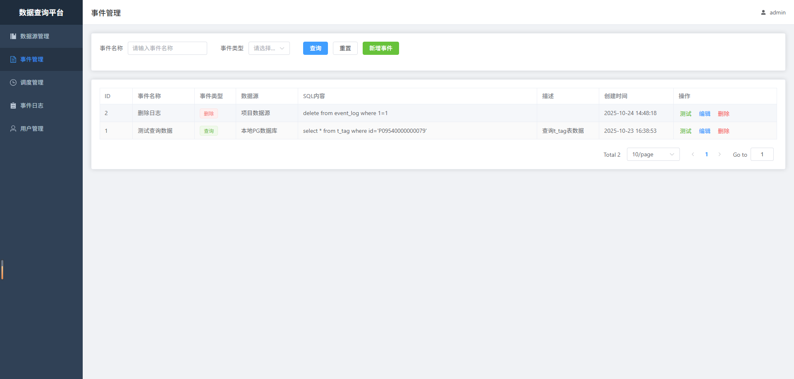
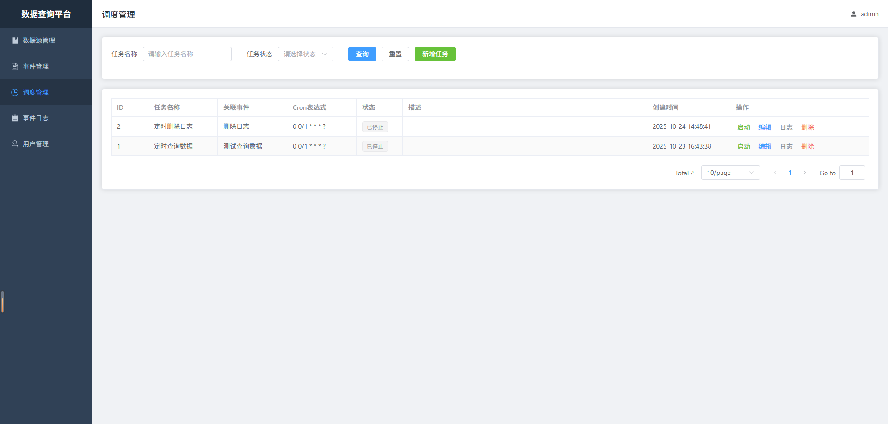
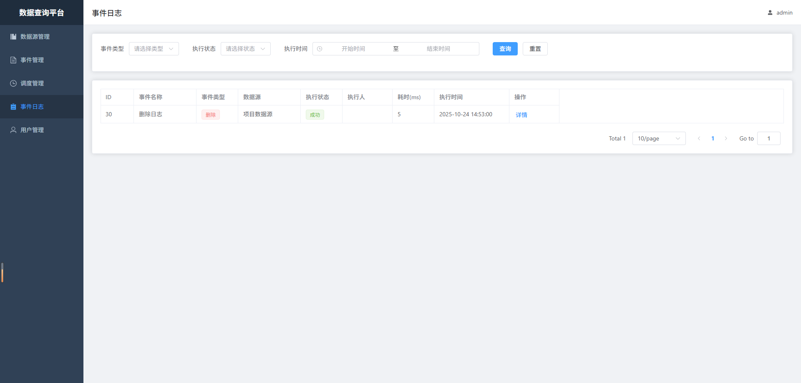

# 数据查询平台

一个功能完整的数据查询和调度管理平台，支持数据源管理、SQL事件管理、定时调度和日志查询。

## 技术栈

### 后端
- **框架**: Spring Boot 2.7.14 + Java 8
- **数据库**: PostgreSQL
- **ORM**: MyBatis-Plus
- **调度**: Quartz
- **认证**: JWT
- **连接池**: Druid

### 前端
- **框架**: Vue 3 + Vite
- **UI组件**: Element Plus
- **状态管理**: Pinia
- **路由**: Vue Router
- **HTTP**: Axios

## 功能特性

### 1. 用户认证
- 用户登录/注册
- JWT Token认证
- 登录状态持久化



### 2. 数据源管理
- 支持MySQL和PostgreSQL数据源
- 新增、编辑、删除数据源
- 连接测试功能
- 数据源列表查询



### 3. 事件管理
- 创建SQL查询/插入/更新/删除事件
- 在线SQL编辑器
- SQL测试执行功能
- 实时查看执行结果
- 支持查看执行耗时



### 4. 调度管理
- 基于Quartz的定时任务调度
- 支持Cron表达式配置
- 启动/停止调度任务
- 查看调度执行日志
- 任务状态实时显示



### 5. 事件日志
- 记录所有SQL执行历史
- 按事件类型、执行状态筛选
- 按时间范围查询
- 详细的执行信息展示（SQL内容、执行结果、错误信息等）



## 快速开始

### 前置要求
- JDK 8+
- Maven 3.6+
- Node.js 16+
- PostgreSQL 12+

### 数据库初始化

1. 创建数据库：
```sql
CREATE DATABASE data_query_platform;
```

2. 执行初始化脚本：
```bash
psql -U postgres -d data_query_platform -f src/main/resources/sql/schema.sql
```

3. 修改配置文件 `src/main/resources/application.yml`：
```yaml
spring:
  datasource:
    url: jdbc:postgresql://localhost:5432/data_query_platform
    username: postgres
    password: your_password
```

### 启动后端

```bash
cd data-query-platform
mvn clean install
mvn spring-boot:run
```

后端服务将在 http://localhost:8080 启动

### 启动前端

```bash
cd data-query-frontend
npm install
npm run dev
```

前端应用将在 http://localhost:3000 启动

### 默认账号

- 用户名: `admin`
- 密码: `admin123`

## 项目结构

### 后端结构
```
data-query-platform/
├── src/main/java/com/example/dataquery/
│   ├── config/          # 配置类（MyBatis-Plus、Quartz、Web等）
│   ├── controller/      # 控制器
│   ├── dto/            # 数据传输对象
│   ├── entity/         # 实体类
│   ├── mapper/         # MyBatis Mapper接口
│   ├── service/        # 业务服务层
│   ├── quartz/         # Quartz调度任务
│   ├── util/           # 工具类（JWT、UserContext等）
│   ├── exception/      # 异常处理
│   └── common/         # 通用类（Result、PageRequest等）
├── src/main/resources/
│   ├── application.yml # 应用配置
│   └── sql/           # 数据库脚本
└── pom.xml
```

### 前端结构
```
data-query-frontend/
├── src/
│   ├── api/           # API接口定义
│   ├── assets/        # 静态资源
│   ├── router/        # 路由配置
│   ├── utils/         # 工具类（request等）
│   ├── views/         # 页面组件
│   │   ├── Login.vue       # 登录页
│   │   ├── Layout.vue      # 布局页
│   │   ├── DataSource.vue  # 数据源管理
│   │   ├── Event.vue       # 事件管理
│   │   ├── Schedule.vue    # 调度管理
│   │   └── EventLog.vue    # 事件日志
│   ├── App.vue        # 根组件
│   └── main.js        # 入口文件
├── index.html
├── package.json
└── vite.config.js
```

## API文档

### 认证接口
- `POST /api/auth/login` - 用户登录
- `POST /api/auth/register` - 用户注册

### 数据源接口
- `GET /api/datasource/page` - 分页查询数据源
- `GET /api/datasource/list` - 查询所有数据源
- `GET /api/datasource/{id}` - 获取数据源详情
- `POST /api/datasource` - 创建数据源
- `PUT /api/datasource/{id}` - 更新数据源
- `DELETE /api/datasource/{id}` - 删除数据源
- `POST /api/datasource/test` - 测试连接

### 事件接口
- `GET /api/event/page` - 分页查询事件
- `GET /api/event/list` - 查询所有事件
- `GET /api/event/{id}` - 获取事件详情
- `POST /api/event` - 创建事件
- `PUT /api/event/{id}` - 更新事件
- `DELETE /api/event/{id}` - 删除事件
- `POST /api/event/execute` - 执行SQL

### 调度接口
- `GET /api/schedule/page` - 分页查询调度任务
- `GET /api/schedule/{id}` - 获取任务详情
- `POST /api/schedule` - 创建调度任务
- `PUT /api/schedule/{id}` - 更新调度任务
- `DELETE /api/schedule/{id}` - 删除调度任务
- `POST /api/schedule/{id}/start` - 启动任务
- `POST /api/schedule/{id}/stop` - 停止任务

### 日志接口
- `GET /api/event-log/page` - 分页查询事件日志
- `GET /api/schedule-log/page` - 分页查询调度日志

## 使用示例

### 1. 添加数据源
1. 登录系统后，进入"数据源管理"
2. 点击"新增数据源"
3. 填写数据源信息（名称、类型、主机、端口、数据库名、用户名、密码）
4. 点击"测试连接"验证配置
5. 点击"确定"保存

### 2. 创建查询事件
1. 进入"事件管理"
2. 点击"新增事件"
3. 填写事件名称，选择事件类型（如"查询"）
4. 选择数据源
5. 在SQL编辑框中输入SQL语句
6. 点击"测试执行"查看结果
7. 点击"确定"保存

### 3. 创建调度任务
1. 进入"调度管理"
2. 点击"新增任务"
3. 填写任务名称
4. 选择关联的事件
5. 输入Cron表达式（如 `0 0/5 * * * ?` 表示每5分钟执行一次）
6. 点击"确定"保存
7. 点击"启动"开始调度

### 4. 查看执行日志
1. 进入"事件日志"
2. 可按事件类型、执行状态、时间范围筛选
3. 点击"详情"查看完整的执行信息

## Cron表达式说明

格式：`秒 分 时 日 月 周`

常用示例：
- `0 0/5 * * * ?` - 每5分钟执行一次
- `0 0 * * * ?` - 每小时执行一次
- `0 0 0 * * ?` - 每天0点执行一次
- `0 0 12 * * ?` - 每天12点执行一次
- `0 0 0 * * MON` - 每周一0点执行一次

## 注意事项

1. 首次使用需要先添加数据源
2. 调度任务启动后会按照Cron表达式定时执行
3. 所有SQL执行都会记录日志
4. 建议定期清理历史日志数据
5. 生产环境请修改JWT密钥和默认密码

## 常见问题

### Q: 无法连接数据源？
A: 请检查数据源配置是否正确，确保数据库服务正常运行，网络可达。

### Q: 调度任务无法启动？
A: 请检查Cron表达式是否正确，事件是否存在且可用。

### Q: Token过期怎么办？
A: Token默认有效期为24小时，过期后需要重新登录。

## 开发计划

- [ ] 支持更多数据源类型（Oracle、SQL Server等）
- [ ] SQL语法高亮和智能提示
- [ ] 数据可视化展示
- [ ] 数据导出功能（Excel、CSV）
- [ ] 操作审计日志

## 许可证

MIT License

## 联系方式

如有问题或建议，请提Issue。
